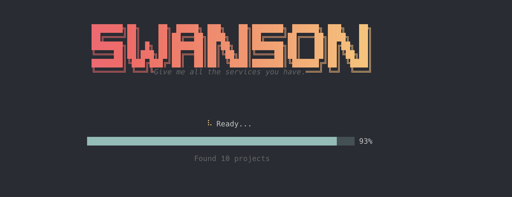
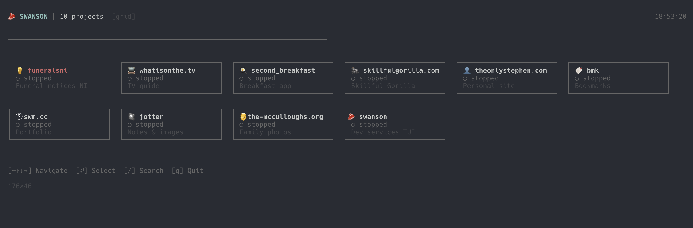

# Swanson

<p align="center">
  
</p>

> "Give me all the services you have."

A no-nonsense TUI for managing local development projects. Built with React and Ink.

## Screenshots

### Splash Screen


### Project Grid


## Features

- **Quick launcher** - Fuzzy search across all your projects
- **Project dashboard** - Make targets, GitHub issues, and PRs at a glance
- **Log viewer** - Stream output from running commands
- **Git integration** - Status display + lazygit launcher
- **GitHub integration** - View issues and PRs, open in browser
- **Makefile detection** - Auto-discovers `local.*` targets
- **Responsive layout** - Grid view on large terminals, list view on small

## Installation

```bash
# Install dependencies
make local.install

# Run in development mode
make local.dev

# Or build and link globally
make local.link
swanson
```

## Usage

### Keyboard Shortcuts

#### Project List
| Key | Action |
|-----|--------|
| `↑` `↓` `←` `→` | Navigate (grid mode) |
| `↑` `↓` | Navigate (list mode) |
| `⏎` | Select project |
| `/` | Search |
| `q` | Quit |

#### Project Dashboard
| Key | Action |
|-----|--------|
| `↑` `↓` | Select make target |
| `⏎` | Run selected target |
| `r` | Run selected target |
| `i` | Open issues in browser |
| `p` | Open PRs in browser |
| `g` | Launch lazygit |
| `Esc` | Back to project list |
| `q` | Quit |

#### Log Viewer
| Key | Action |
|-----|--------|
| `q` / `Esc` | Stop process and exit |

## Prerequisites

Swanson checks for these tools at startup:

- **git** - Required for repository status
- **gh** - GitHub CLI for issues/PRs
- **lazygit** - Terminal UI for git (optional but recommended)
- **make** - For running Makefile targets

## Makefile Targets

| Target | Description |
|--------|-------------|
| `make local.dev` | Run TUI in development mode |
| `make local.build` | Compile TypeScript to dist/ |
| `make local.install` | Install npm dependencies |
| `make local.clean` | Remove dist/ and node_modules/ |
| `make local.link` | Build and link globally |
| `make local.test` | Run tests |

## Project Structure

```
swanson/
├── assets/
│   ├── swanson.png
│   ├── swanson_title.png
│   └── swanson_projects.png
├── bin/
│   └── swanson.js
├── src/
│   ├── index.tsx
│   ├── app.tsx
│   ├── components/
│   │   ├── Splash.tsx
│   │   ├── ProjectList.tsx
│   │   ├── ProjectDashboard.tsx
│   │   ├── IssuesBrowser.tsx
│   │   └── LogViewer.tsx
│   ├── hooks/
│   │   └── useTerminalSize.ts
│   └── lib/
│       ├── github.ts
│       ├── git.ts
│       ├── lazygit.ts
│       ├── makefile.ts
│       ├── prerequisites.ts
│       ├── process.ts
│       └── projects.ts
├── Makefile
├── package.json
└── tsconfig.json
```

## Tech Stack

- **React** - UI components
- **Ink** - React renderer for CLI
- **TypeScript** - Type safety
- **GitHub CLI** - Issues and PR integration

## License

MIT
